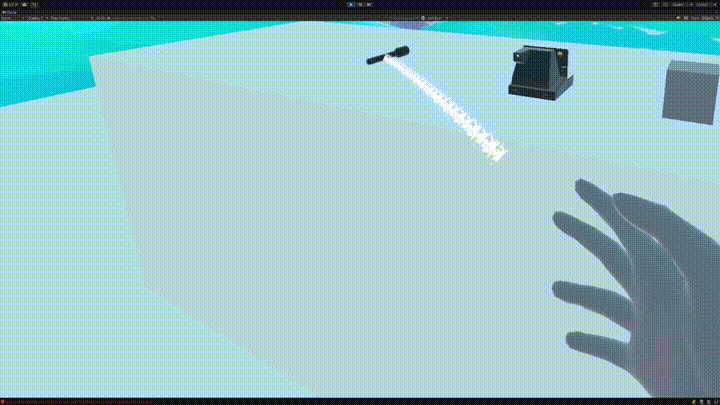
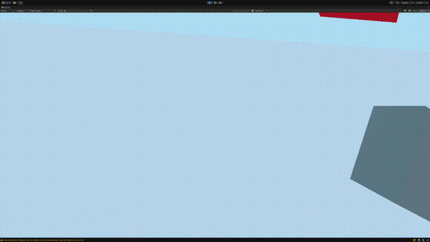

👋 Hi, I'm Louis — XR / 3D Software Engineer

I build interactive systems for virtual and mixed reality using Unity.

## 🎥 Demo

Lightweight examples of modular XR interaction systems (remote grab, inventory)

<h3>Remote Grab</h3>

<h3>Inventory System</h3>

💼 What I do

- XR development (VR/AR/MR) with Unity
- OpenXR & XR Interaction Toolkit
- Interaction systems design (grab, sockets, anchors, etc.)
- Real-time 3D applications and tools
- Experience with digital twins and research-oriented projects

🚀 Featured Projects

- 🔧 Core  
  Reusable foundation for Unity projects (debug tools, utilities, shared systems)  
  👉 https://github.com/Louis27140/Core

- 🕶 XR-Interactions  
  Modular interaction framework built on top of XR Interaction Toolkit  
  (custom grab logic, sockets, interaction strategies)  
  👉 https://github.com/Louis27140/XR-Interactions

🎯 Focus

I care about building clean, reusable systems rather than one-off prototypes.

💡 Interests

- XR & immersive tech
- Game development
- System architecture in Unity
